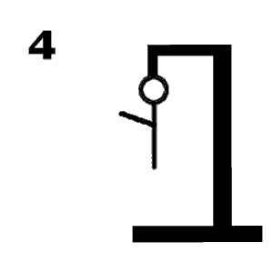

# Galgje

## Te raden woord

|.|.|.|O|O|.|
|-|-|-|-|-|-|
|1|2|3|4|5|6|

## Score

## Beurten
eerste: E
Nope, er is geen E
-------------------
tweede: A
Nope, er is geen A
-------------------
derde: O
Yep, die zit er in!
-------------------
Vierde: P
Nope, er is geen P
-------------------
vijfde: C