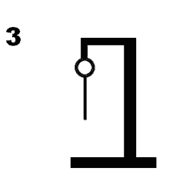

# Galgje

## Te raden woord

|.|.|.|.|.|.|
|-|-|-|-|-|-|
|1|2|3|4|5|6|

## Score

## Beurten
eerste: E
Nope, er is geen E
-------------------
tweede: A
Nope, er is geen A
-------------------
derde: O